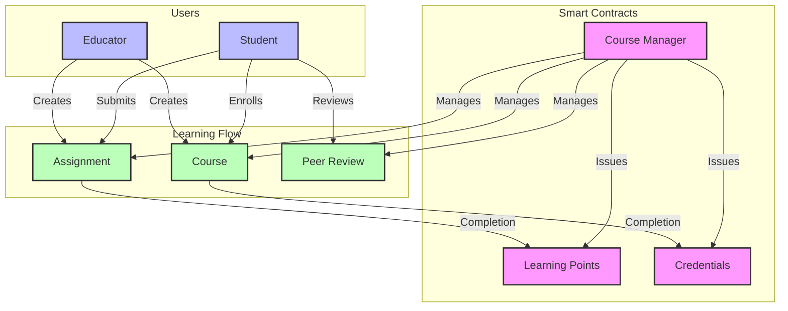

# Student Activity Dashboard

## Overview

A real-time blockchain analysis tool that helps monitor student engagement and learning activities in an educational blockchain environment. The system analyzes student participation patterns, learning interactions, and account characteristics to calculate engagement scores and identify learning patterns.




### Student Engagement Score

Implementation of tracking student engagement scores based on their on-chain learning activities.

### Learning Pattern Analysis

Implementation of engagement tracking measures:

1. Time Pattern Analysis - Tracks study session durations and timing patterns
2. Network Analysis of peer interactions - Identifies collaborative learning patterns
3. Activity Pattern Detection - Identifies consistent learning habits and engagement

## Features

- Example EduChain db ✅
- Mock data generation for students and learning activities ✅
- Real-time new db record detection and score update ✅
- Student engagement score calculation ✅
- Learning pattern analysis ✅
- Dashboard for educational analytics visualization ✅

## Integration with

- Using your preferred library e.g. `Ethers`, `Viem, `Web3.js` for every block on EduChain fetch all activities and filter them by interactions with your learning smart contracts, educational tokens, or between students. Individual learning activities should be saved into Supabase.

- On enrollment or first interaction with your educational smart contracts the student should be added to the students table.

- Now complete setup to run the backend service, frontend and prepare supabase.

## Setup

### Backend

- Run `npm i` inside `/backend` directory in order to install dependencies.

- Create new Supabase project and fill out `.env` variables with your url and api key.

- Run SQL queries inside your supabase SQL editor to initialize it:

```SQL
CREATE TABLE IF NOT EXISTS public.students (
    id UUID PRIMARY KEY DEFAULT gen_random_uuid(),
    wallet_address VARCHAR NOT NULL UNIQUE,
    student_name VARCHAR NOT NULL,
    grade_level INTEGER DEFAULT 1,
    learning_points INTEGER DEFAULT 0,
    created_at TIMESTAMP WITH TIME ZONE DEFAULT TIMEZONE('utc', NOW()),
    total_activities INTEGER DEFAULT 0
);

CREATE TABLE IF NOT EXISTS public.learning_activities (
    id UUID PRIMARY KEY DEFAULT gen_random_uuid(),
    student_address VARCHAR NOT NULL,
    resource_address VARCHAR NOT NULL,
    points_earned DECIMAL NOT NULL,
    activity_type VARCHAR NOT NULL,
    timestamp TIMESTAMP WITH TIME ZONE DEFAULT TIMEZONE('utc', NOW())
);

CREATE TYPE engagement_level AS ENUM ('LOW', 'MODERATE', 'HIGH');

CREATE TABLE IF NOT EXISTS public.activity_scores (
    id UUID PRIMARY KEY DEFAULT gen_random_uuid(),
    wallet_address VARCHAR NOT NULL UNIQUE,
    total_score DECIMAL NOT NULL,
    participation_score DECIMAL NOT NULL,
    engagement_score DECIMAL NOT NULL,
    consistency_score DECIMAL NOT NULL,
    duration_score DECIMAL NOT NULL,
    active_days INTEGER NOT NULL,
    total_points DECIMAL NOT NULL,
    activity_count INTEGER NOT NULL,
    engagement_level engagement_level NOT NULL,
    engagement_factors JSONB DEFAULT '[]',
    learning_progress INTEGER NOT NULL DEFAULT 0,
    peer_interactions_count INTEGER DEFAULT 0,
    collaborative_activities_count INTEGER DEFAULT 0,
    first_activity_date TIMESTAMP WITH TIME ZONE,
    last_activity_date TIMESTAMP WITH TIME ZONE,
    calculated_at TIMESTAMP WITH TIME ZONE DEFAULT TIMEZONE('utc', NOW())
);

CREATE INDEX IF NOT EXISTS idx_activity_scores_wallet ON activity_scores(wallet_address);
CREATE INDEX IF NOT EXISTS idx_activity_scores_engagement ON activity_scores(engagement_level);
CREATE INDEX IF NOT EXISTS idx_activity_scores_progress ON activity_scores(learning_progress);

CREATE OR REPLACE FUNCTION update_calculated_at()
RETURNS TRIGGER AS $$
BEGIN
    NEW.calculated_at = TIMEZONE('utc', NOW());
    RETURN NEW;
END;
$$ LANGUAGE plpgsql;

CREATE TRIGGER update_activity_scores_timestamp
    BEFORE UPDATE ON activity_scores
    FOR EACH ROW
    EXECUTE FUNCTION update_calculated_at();

CREATE OR REPLACE VIEW highly_engaged_students AS
SELECT
    wallet_address,
    total_score,
    learning_progress,
    engagement_level,
    engagement_factors,
    peer_interactions_count,
    collaborative_activities_count,
    activity_count,
    calculated_at
FROM activity_scores
WHERE engagement_level = 'HIGH'
OR learning_progress > 80
ORDER BY learning_progress DESC, total_score DESC;

CREATE OR REPLACE FUNCTION get_engagement_summary(address VARCHAR)
RETURNS TABLE (
    wallet_address VARCHAR,
    engagement_level engagement_level,
    learning_progress INTEGER,
    engagement_factors JSONB,
    peer_interactions_count INTEGER,
    learning_patterns JSON
) AS $$
BEGIN
    RETURN QUERY
    SELECT
        a.wallet_address,
        a.engagement_level,
        a.learning_progress,
        a.engagement_factors,
        a.peer_interactions_count,
        json_build_object(
            'collaborative_activities', a.collaborative_activities_count,
            'total_activities', a.activity_count,
            'active_days', a.active_days
        ) as learning_patterns
    FROM activity_scores a
    WHERE a.wallet_address = address;
END;
$$ LANGUAGE plpgsql;
```

- Enable **Realtime** for every table in the Supabase UI(this is needed for activity listener).

- Run `mockupGenerator` to generate initial mockup data for the students and learning activities.

- Run `npm run start` to run activity listener and score updater.

### Frontend

- Move to /frontend directory

- Install dependencies with `npm i`.

- Fill out `.env` with your variables.

- Run web app with `npm run dev`.
